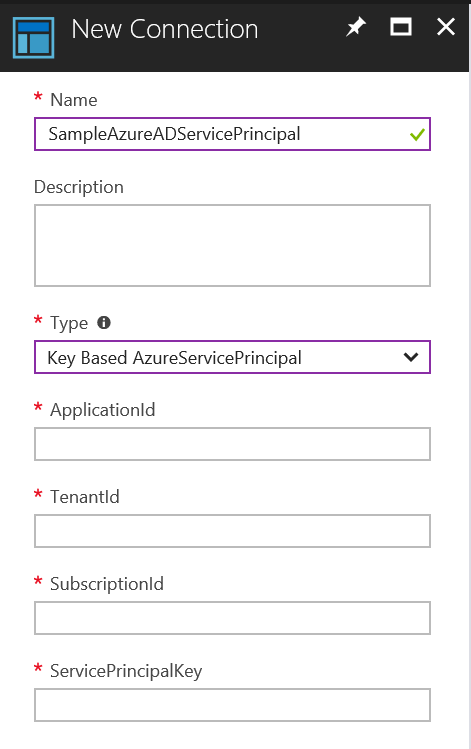

# AzureServicePrincipalAccount PowerShell Module

#### Module version history
| Author | Date | Version | Comment |
|:--- | :---: | :---: | :---
Tao Yang | 06/10/2017 | 1.0.0 | Initial release

## Introduction
The **AzureServicePrincipalAccount** Powershell module is designed to simplify the Azure Sign-In process within the Azure Automation accounts using Azure AD Service Principals.

By the default, the Azure AD Service Principal connection type provided by Azure Automation accounts only supports certificate-based Azure AD Service Principals. This module provides an additional connection type for key-based Service Principals:

When you are using an Azure service principal connection defined in your automation account, no matter whether you use the built-in certificate-based connection, or the key-based connection defined in this module, you can simply use an unique command to sign-in to your Azure subscription:
~~~PowerShell
Add-AzureRMServicePrincipalAccount -AzureServicePrincipalConnection $AzureSPConnection
~~~

#### Sample PowerShell Runbook
~~~PowerShell
[CmdletBinding()]
Param(
  [String]$ConnectioNName
)

$AzureSPConnection = Get-AutomationConnection -Name $ConnectioNName

If ($AzureSPConnection)
{
  $Login = Add-AzureRMServicePrincipalAccount -AzureServicePrincipalConnection $AzureSPConnection
  $Login.Context
} else {
  Write-Error "Connection asset '$ConnectionName' does not exist in this Automation account."
}
~~~